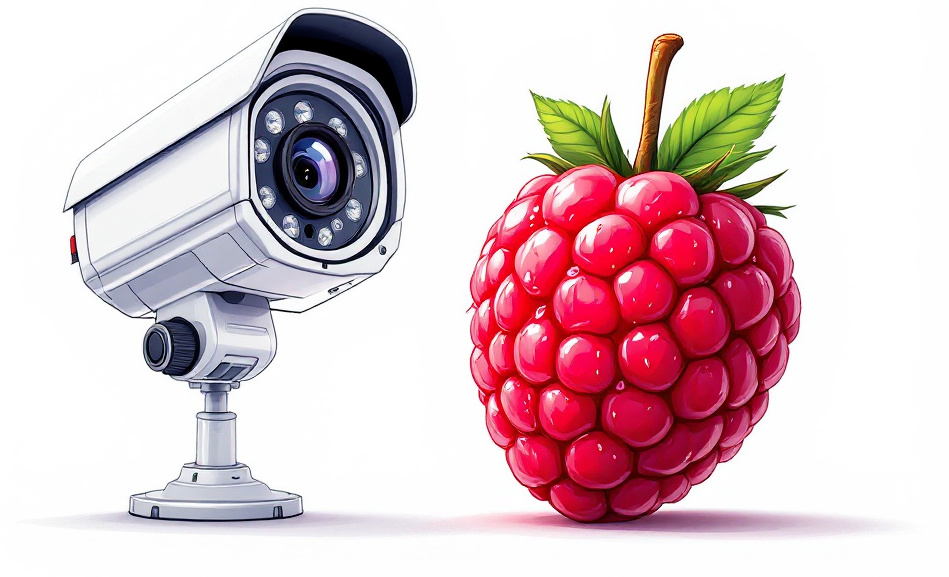
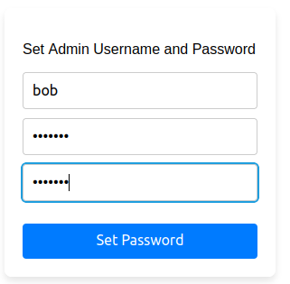
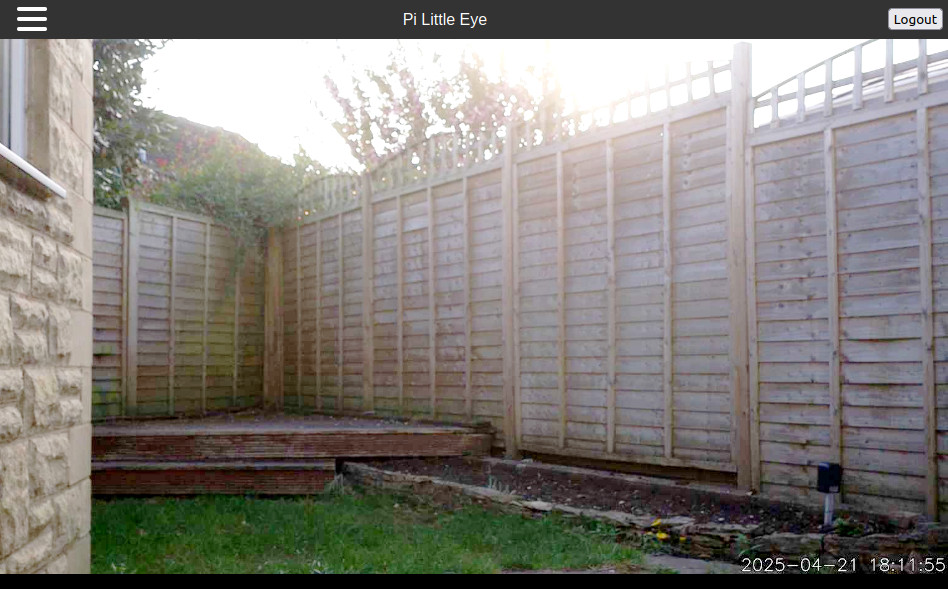
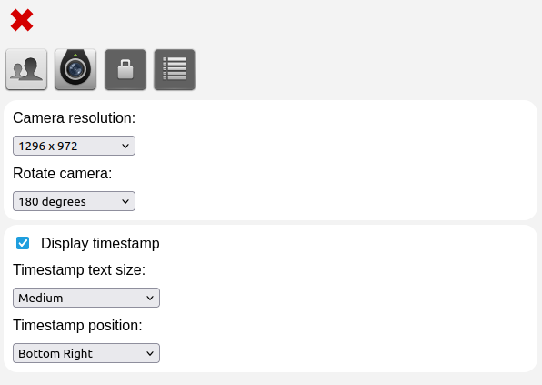
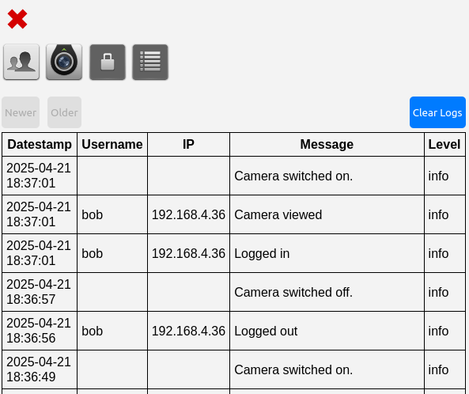
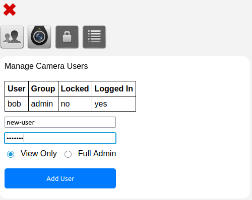
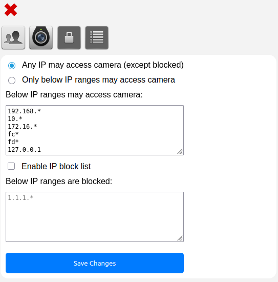
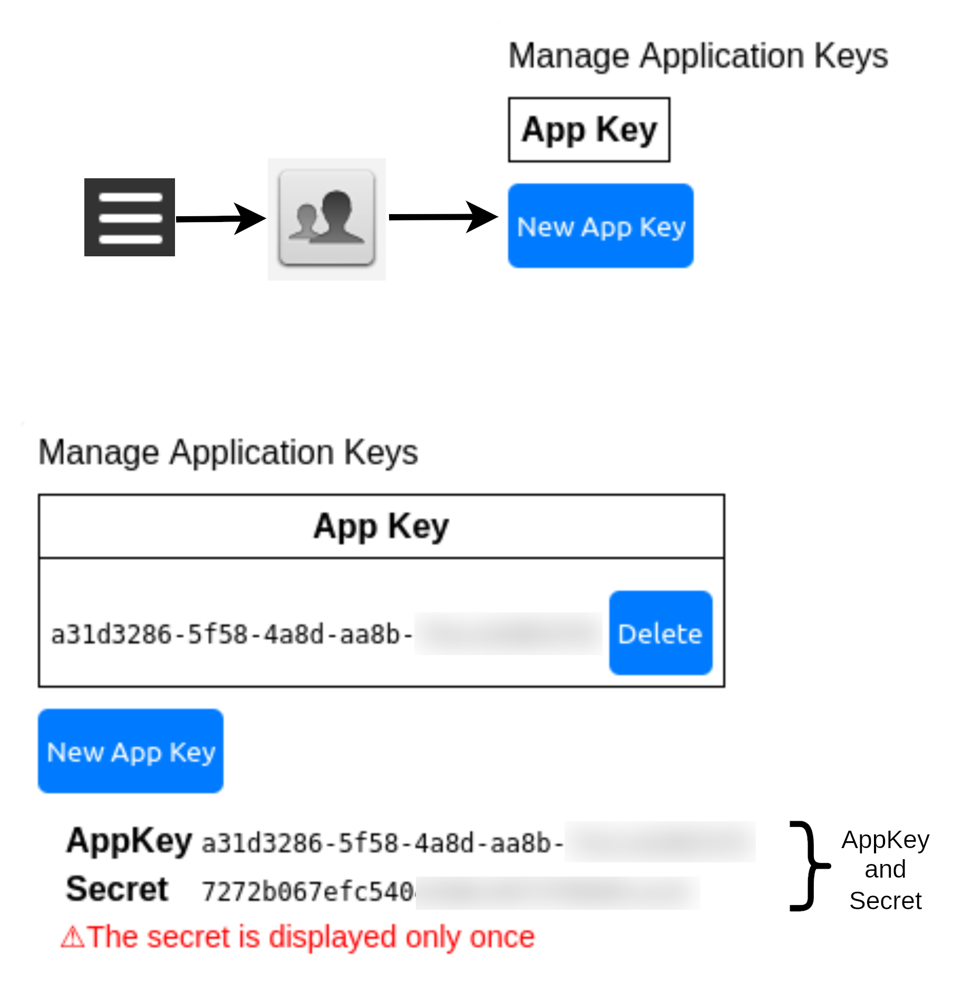
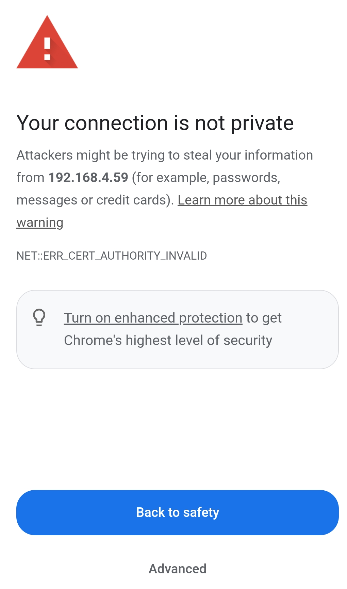

**Pi Little Eye** is a security camera for the Raspberry Pi using the official camera modules.<br>

- Viewable on all devices with a browser.
- No app required. All phones supported.
- No cloud. No subscriptions. No Telemetry.
- Image can be rotated and time stamped
- Video can be streamed to other devices e.g. for storage
- Supports multiple user accounts
- Supports IP whitelists and block lists
- Runs over https
- Maintains access logs

## Installation

These instructions are for the regular version of the Raspberry Pi OS 64-bit bookworm edition upwards. 

The raspberry pi must have an official camera module attached (any version). The project does not work with USB cameras. See here for [raspberry pi camera installation instructions](https://leoncode.co.uk/articles/installing-the-raspberry-pi-camera-module/).

To install into a Python virtual env:

```
git clone https://github.com/InexplicableMagic/pi-little-eye/
cd pi-little-eye

python -m venv camera-env --system-site-packages
source camera-env/bin/activate
pip install -r requirements.txt
```

The ```--system-site-packages``` option permits use of Python modules installed system-wide outside of the venv. This is particularly for the picamera2 module which should be installed by default in bookworm and does not seem to install particularly easily into a venv.

## Starting the Camera

To start the camera:

```
source camera-env/bin/activate
./camera_server.py
```

This will start the camera on port 5220 by default. You can change the port with the ```--port``` option.

To start the camera in the background you can do ```nohup ./camera_server.py &```

The default host interface is ```0.0.0.0``` which is for access from any IPv4 network interface and should be fine for most purposes. However, if you want to start the camera on the IPv6 interface it can be achieved with this option: ```--host ::```


## Usage

Access the camera via a web browser like this. Note, the camera runs over **https** and is not accessible via http:

```https://your-raspberry-pi:5220/```

When first connecting you will receive a **certificate warning**. This is entirely expected and is because a self-signed certificate is being used. Just click through it by whatever means is provided in your browser. Often the button you need to click to ignore the message is tiny and obscure to avoid people not reading it. On Chrome it's under "Advanced". Once you have clicked through it once, you won't see the message again. If you are unsure what this message means, see the [self-signed certifiate section](#Self-Signed-Certificate) below for an explanation.

On first connection, you will be asked to set the initial admin username and password for the camera:



Then login and the security camera image should be displayed.



There is a hamburger menu in the upper left corner for options.

## Configuration

The resolution and rotation of the camera can be modified in the options menu. In addition the timestamp size and position can be changed.



A log of all user activity is recorded in the logs panel including the connecting IP and user name:



Additional camera users can be added from the users panel. User accounts can be locked and other users can also be logged out by an admin. User accounts are automatically locked out after 10 failed password attempts.



By default any IP can access the camera. However a specific set of IPs can be whitelisted using the top box on the security panel. One trailing wildcard (an asterisk character) is also permitted to wildcard a specific IP range. To enable the whitelist click the "Only below IP ranges may access camera" radio button.

Additionally specific IPs or ranges can also be placed on a block list using the lower box. These IPs will be prevented from accessing the camera. Check the "Enable IP block list" checkbox to enable the list.



### Streaming Video

To stream the video to another device, first you need to make an application key to authenticate with the camera. This can be found in the account settings in the options:



The video is available in MJPEG format at the endpoint: ```/api/v1/video/mjpeg```. The appkey and associated secret are supplied as GET parameters as follows. This will save the video to the file "output.mp4" in the native MPJEG codec:

```curl -k -s "https://your-raspberry-pi:5220/api/v1/video/mjpeg?appkey=THE-APP-KEY&secret=THE-SECRET" | ffmpeg -i - -vcodec copy output.mp4```

MPJEG video files can be quite large. If you prefer, you can compress the video into e.g. H.264 (one of the most common video codecs) on the fly like this which will produce a smaller file size. The disadvantage is this will consume a fairly large amount of CPU resource to do the compression whereas storing the original MJPEG requires almost no CPU.

```curl -k -s "https://your-raspberry-pi:5220/api/v1/video/mjpeg?appkey=THE-APP-KEY&secret=THE-SECRET" | ffmpeg -i - -vcodec libx264 output-compressed.mp4```

### Self-Signed Certificate

When connecting to the camera for the first time, your brower will display a large fearsome looking message proclaiming that the connection is "not secure" or some such wording. Don't worry, the connection **is encrypted** with TLS (https) to at least the same standard as every other https connection, and possibly better. What the message is saying is that your browser is unable to verify who owns the camera.



When you connect to your bank over the web, how do you know that your bank actually owns the server you are connecting to? This is achieved by having a "trusted" 3rd party counter-sign that the certificate presented by the bank's server does in fact belong to the bank. In this case we have not done that step because it involves either money or a beaurocratic verification process. Instead the camera auto-generates what's called a "self-signed" certificate which does not bear the counter-signatory from the 3rd party that your browser expects. While you definitely shouldn't click through the message if you are trying to connect to your bank (and that's why it's so loud and bold) in this case it's fine because we already know who owns the camera - you do. In this instance there is no concern about who owns the device.

If you have a browser valid certificate for your camera, you can supply it on the command line and you won't get the message. However, if you're only ever going to be using the camera yourself, there is little point in going to that trouble as it won't do anything to enhance security over a self-signed certificate. All it does is get rid of the warning. Once you've clicked through it once, the browser will remember your decision and you won't be asked again.

